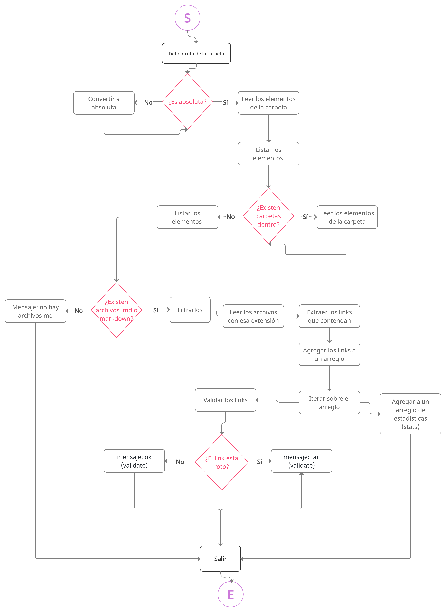

# Markdown Links

## Índice

* [1. Preámbulo](#1-preámbulo)
* [2. Indicaciones](#2-indicaciones)
* [3. Sistemas operativos](#3-sistemas-operativos)
* [4. Módulos empleados](#4-módulos-empleados)

***

## 1. Preámbulo

MD-Links es una herramienta que busca ayudar a los desarrolladores a poder filtrar links de archivos markdown y analizarlos, 
con el comando md-links /Ruta del archivo o carpeta/ --validate les devolvera el objeto:

* `href`: URL encontrada.
* `text`: Texto que aparecía dentro del link (`<a>`).
* `file`: Ruta del archivo donde se encontró el link.
* `status`: Código de respuesta HTTP.
* `ok`: Mensaje `fail` en caso de fallo u `ok` en caso de éxito.

En caso de que la bandera sea --stats la consola devolvera:


```sh
$ md-links ./some/example.md --stats
Total: 3
Unique: 3
```

## 2. Indicaciones
**Instala la dependendcia con npm install md-links-nay**

**Elige tu ruta puede ser absoluta o relativa, la herramienta puede analizar 
archivos individuales o puedes pasarle una carpeta y te devolvera todos los 
links que encuentre en cada archivo que exista en dicho fichero**

**Usa las banderas --validate o --stats dependiendo lo que desees obtener, también 
puedes combinarlas o usar solo -v o -s**


## 3. Sistemas operativos

Por ahora solo se ha testeado su funcionalidad en Windows.

## 4. Módulos empleados

`"chalk": "^4.1.2"`

`"commander": "^8.3.0"`    

`"figlet": "^1.5.2"`

`"gradient-string": "^1.2.0"`

`"marked": "^3.0.7"`

`"node-fetch": "^2.6.5"`

## 5. Diagrama de flujo

